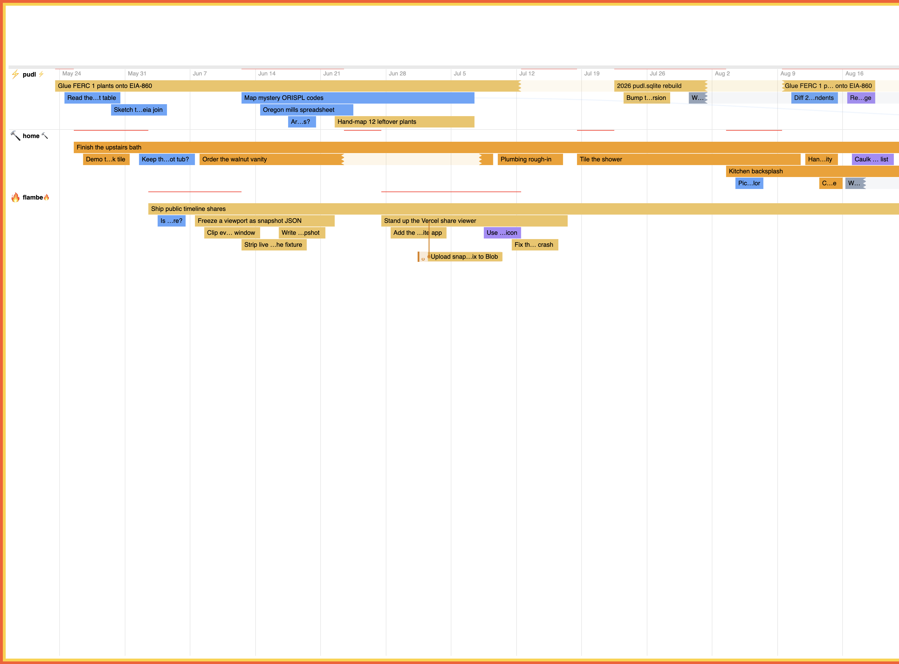

# Flambé

Flambé is a glorified todo app. Its distinction is that it orients your tasks
and effort into a **flame chart** — flame charts for humans.

You still have work to do. Instead of a flat list, activities nest and sit on a
timeline the way a profiler shows a call stack: when you go down a rabbit hole,
you see it; when you come back up, you see that too.

It can also show agentic work on the same chart. Coding agents report the same
kind of nested activities, so human effort and agent effort share one flame.



## Try it on one machine

Local mode is Node 22 and SQLite. It binds loopback only.

```sh
npm --prefix frontend ci
npm --prefix frontend run build:local
node cli/bin/flambe.mjs serve
```

Open http://127.0.0.1:4001. Sign-in accepts any password and opens the local
user. The process prints `FLAMBE_URL`, `FLAMBE_API_TOKEN`, and
`FLAMBE_TRACE_ID` if you later point agents at this machine.

That command serves the built SPA from `backend/priv/static`. The npm CLI
package does not ship those assets; pass
`--static /path/to/backend/priv/static`, or run Vite against the local API
(`VITE_API_URL=http://127.0.0.1:4001` in `frontend/.env.local`).

Cloud agents cannot reach loopback — [host an instance](#host-your-own-instance)
when they run elsewhere. To copy selected history onto a hosted instance later:

```sh
flambe export work.json
flambe import work.json --url https://your-app.fly.dev --token flb_...
```

Import creates a **new** trace on that account (or skips if that export was
already imported). Tokens and credentials are not part of the file.

## Connect coding agents

Agents are optional. They use the same nested activities you already see on the
chart.

```sh
npm install -g @davvidbaker/flambe-cli
```

Create a token in Settings → API tokens (shown once; the server stores a
SHA-256 hash). From a local Mix checkout,
`mix flambe_next.create_api_token you@example.com "Claude"` also works. In the
project where the agent runs:

```dotenv
FLAMBE_URL=https://your-app.fly.dev
FLAMBE_API_TOKEN=flb_...
FLAMBE_TRACE_ID=1
# FLAMBE_THREAD=flambe
```

Shell environment variables win over `.env`. Do not commit `.env`. Do not put
`FLAMBE_AGENT_ID`, `FLAMBE_AGENT_NAME`, or `FLAMBE_AGENT_PLATFORM` in `.env` —
the CLI derives those from the session, and the reducer names unnamed agents.

```sh
ACTIVITY_ID=$(flambe start "Inspect authentication flow")
flambe end "$ACTIVITY_ID" "Confirmed bearer-token path"
flambe message "Auth fix needs the session module refactored too; widening scope"
```

`start` nests under that agent's own newest active activity unless you pass
`--parent` or `--root`. `message` asks the reducer whether the work is still on
track; it needs `OPENAI_API_KEY` on the server. Lifecycle commands (`start`,
`end`, `suspend`, `resume`) work without a model.

Copy the `flambe-cli` skill into the agent product you use
([`.cursor/skills/flambe-cli`](.cursor/skills/flambe-cli),
[`.codex/skills/flambe-cli`](.codex/skills/flambe-cli)) so agents treat the
trace as a live stack instead of logging every shell command.

Hosted agents can call the same commands over MCP at `/mcp` with
`Authorization: Bearer <API_TOKEN>`. See the [CLI README](cli/README.md) for
install, Cloud secrets, and command details.

## Host your own instance

Production Flambé is a Phoenix 1.8 app with PostgreSQL: invite-gated signup,
one Machine, in-memory agent presence. Fly.io is the path this repo ships
(`Dockerfile` + `fly.toml`).

**[Host your own Flambé](docs/SELF_HOSTING.md)** covers Fly setup, secrets,
first login, GitHub deploys, and running the Docker image elsewhere.

Keep `fly scale count` at 1. A second Machine would split presence until that
signal moves out of memory.

## Develop from this repo

Requirements: Node 22 LTS, Elixir 1.18 / OTP 27, and PostgreSQL. Native
Windows, macOS, and Linux are supported.

On Windows, install Visual Studio Build Tools with the **Desktop development
with C++** workload (`bcrypt_elixir` needs it). The repo's Windows scripts
locate that toolchain.

The backend defaults to `localhost:5432` with `postgres` / `postgres`. Override
with the usual `PG*` environment variables if yours differ.

```sh
cd backend
mix deps.get
mix ecto.create
mix ecto.migrate
mix phx.server
```

On Windows, `scripts\windows_setup.cmd` then `mix phx.server`.

In another terminal:

```sh
cd frontend
npm ci
npm run dev
```

Open http://localhost:5173, register, and you land on the default `Main` trace.
Vite proxies API, auth, and socket requests to Phoenix at
http://localhost:4001. Local Mix omits `FLAMBE_INVITE_CODE` unless you set it.
`mix flambe_next.seed_e2e` from `backend` seeds the browser-test account.

`npm run build` from `frontend` writes hashed assets into
`backend/priv/static/assets`; Phoenix then serves the SPA at
http://localhost:4001.

### Checks

```sh
cd backend && mix precommit
cd ../cli && npm test
cd ../frontend && npm run typecheck && npm run test:unit && npm run build && npm run test:smoke
```

On Windows, `backend\scripts\windows_check.cmd` then the frontend scripts
above. CI runs backend checks, the CLI, Phoenix-served browser smoke, and a
`MIX_ENV=prod` smoke job.

## Desktop status flame

A native helper shows whether agents have talked to Flambé in the last 30
seconds (outlined / orange / blue sparkling flame) over one SSE connection to
`/api/agent-status/stream`.

- macOS: [`macos/FlambeMenuBar`](macos/FlambeMenuBar/README.md)
- Windows: [`windows/FlambeTaskbar`](windows/FlambeTaskbar/README.md)

## Docs

| Doc | What it is |
|-----|------------|
| [Host your own instance](docs/SELF_HOSTING.md) | Fly / Docker production |
| [Product principles](docs/PRODUCT_PRINCIPLES.md) | What Flambé owns vs agent runtimes |
| [Docs index](docs/README.md) | ADRs, local database, release checklist |

## License

[MIT](LICENSE)
